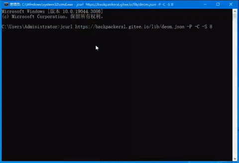

<div style="align: center; margin-top: 60px;">
    <a href="#">
        
    </a>
</div>
<hr>

[](https://www.murphysec.com/accept?code=a111c7f25ae06b96daa00627832e6b68&type=1&from=2&t=2)
[](https://github.com/Backpackerxl/jpkit/releases/tag/jpkit1.0.1)
[](https://github.com/Backpackerxl/jpkit/packages/1773341)
[](https://github.com/Backpackerxl/jpkit/blob/main/LICENSE)

> 这是一个用于Java和JSON之间相互转换的工具。目前，它只针对JSON实现。

- `jpkit` 可以使用插件支持更多的Java类型的解析，在需要时可以快速添加，在不用时可以快速抛弃，实现了动态增强其解析能力
- jpkit 应用案列—— `JCurl`

<div style="align: center;">
    
</div>

#### 快速开始

- 下载导入`jpkit`的jar包
- 准备java bean

> 这里将会使用到lombok插件

```java

@Data // lombok插件
public class B {
    private String name;
    private String desc;
    private Double age;
    private String author;
    private Boolean release;
}
```

```java
public class Test {
    /**
     * jpkit 基础用法
     */
    @Test
    public void useJPKit() {
        // java bean
        B user = new B();
        user.setName("jpkit");
        user.setDesc("jpkit 是一个JSON转化工具！");
        user.setAge(0.6);
        user.setAuthor("backpackerxl");
        user.setRelease(true);
        // 常规转化
        /**
         * 输出：
         * {"name":"jpkit","desc":"jpkit 是一个JSON转化工具！","age":0.6,"author":"backpackerxl","release":true}
         **/
        String s = JSON.stringify(user).terse();
        // 格式化转化
        /**
         * 输出：
         * {
         *    "name": "jpkit",
         *    "desc": "jpkit 是一个JSON转化工具！",
         *    "age": 0.6,
         *    "author": "backpackerxl",
         *    "release": true
         * }
         **/
        String s = JSON.stringify(user).pretty();
        // 将中文以Unicode形式转化
        String s = JSON.stringify(user).ucpJSON();
        // 保存在本地, 默认格式化保存, 无返回值
        String path = "src\\main\\resources\\b.json";
        JSON.stringify(user).save(path);
        // json 字符串
        String json = "{\"name\":\"jpkit\",\"desc\":\"jpkit 是一个JSON转化工具！\",\"age\":0.6,\"author\":\"backpackerxl\",\"release\":true}";
        // 将json解析为JBase
        JBase parse = (JBase) JSON.parse(json);
        // 将json解析为Java Bean
        B user = JSON.parse(json, B.class);
        // 网络json
        String url = "https://fanyi.baidu.com/pc/config";
        // 加载网络json
        JBase net_local = (JBase) JSON.load(url);
        // 本地json 加载为java对象
        B b = JSON.load(path, B.class);
    }
}
```

#### Maven install

**依次执行一下命令**

- 克隆项目

```
git clone https://github.com/Backpackerxl/jpkit.git
```

- 进入项目目录

```
cd jpkit
```

- 为本地仓库安装工具包

```
mvn install
```

**在需要使用的项目中加入依赖**

```xml

<dependency>
    <groupId>com.zzwl</groupId>
    <artifactId>jpkit</artifactId>
    <version>${version}</version>
</dependency>
```

#### `jpkit` [`官方API`](https://backpackerxl.github.io/jpkit/)
